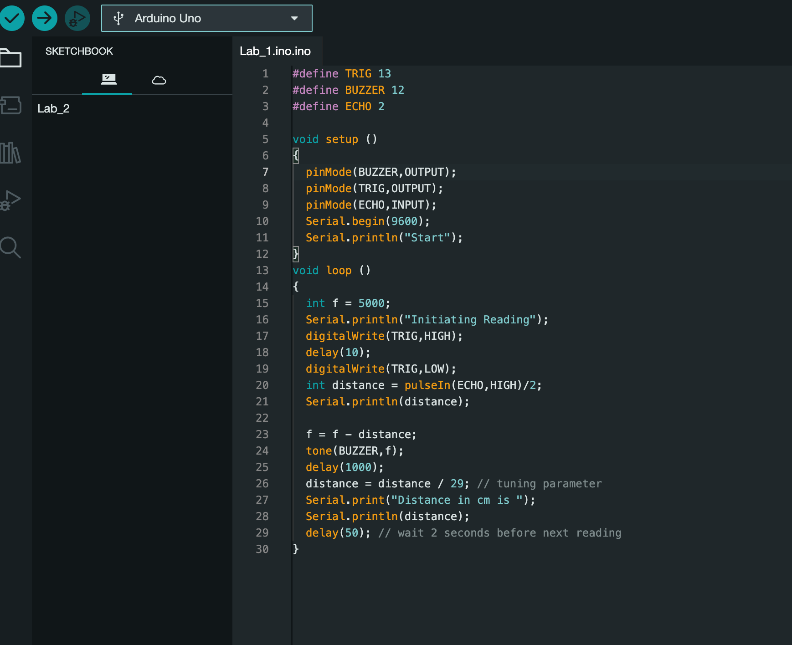

# Lab 04: Microcontrollers, Sensors, and Actuators

## What We Did in The Last Lab

In the previous lab, we delved into digital circuit design, starting with the creation of a 2 to 1 mux using fundamental logic gates like AND, OR, and NOT gates. Progressing further, a 74150 mux chip was utilized to construct a 4 to 1 mux, meticulously wiring based on comprehensive diagrams and documentation. Integrating Arduino, it was employed to control and test the mux's functionality, programming it to manage input data and control lines while validating output accuracy through systematic testing. Lastly, a 1-bit adder circuit was designed and implemented, showcasing proficiency in combining logic gates for arithmetic operations. For more in-depth lab details, refer to the previous lab blog post in this [URL](https://github.com/mlcourses/lab-3-blog-post-group5_cs281/blob/main/post.md)

## Overview and Motivation
In this lab, we'll use the arduino microcontroller to communicate and interact with our surrondings. This lab is broken into five different parts. Four of which are exploratory exercises, where we will learn about and use two sensors and two actuators. These include a Buzzer, a Servo, a Ultrasonic Sensor, and a Photoresistor. The Buzzer is an actuator that produces a sound when there are changes in the environment. The Servo is a motor that reacts pulses it gets from the arduino controller. The Ultrasonic Sensor, similar to a sonar radar, uses sonar to measaur distance. The Photoresistor measures how bright a light is. The fifth section of the lab will consists of a design challege. We will choose between a light detector, a distance detector, or a mechanical light follower and design and implement that project. The challenge is developing our own code for the arduino controller, along with devloping our own design to build one of the projects listed above.

## Lab Objectives


## Materials

- PB-503 breadboard prototyping station

- Arduino microcontroller

- Buzzer

- Ultrasonic Sensor

- Wires and connection tools

- Logic Probes

- Arduino IDE software

- USB cable

- Laptop or device for programming and powering the Arduino


## Project Steps

### 1. Buzzer

- In this first part of the lab, we are going to familiarize ourselves with implementing a simple actuator called a buzzer. The buzzer serves to create a tangible change in the surrounding environment by emitting a sound, the intensity of which is regulated by a series of pulses directed to the buzzer.

- The buzzer comprises of two input pins: `+` and `-`. 

- Inside the buzzer is a metallic membrane. In its default state, when no voltage is applied across the input pins, the membrane remains contracted (inward). However, when a 5-volt difference is applied across these pins, the metallic membrane becomes excited, extending outward. This transition from the default state to the excited state, or vice versa, results in an audible click. By rapidly alternating the voltage, we can prompt the buzzer to generate a tone. 

- The frequency of this vibration determines the pitch or frequency of the produced tone.

#### Testing the Buzzer

1.  For the first test of the buzzer, we can start with plugging the buzzer onto the breadboard so that the two pins span two distinct rows with the `+` pin in the higher row and the `-` pin is in the lower row. 

- We will wire the `-` pin to Ground, and plug one end of a test wire to the `+` pin. 

- Using the other end of the test wire, we can touch it and release to any +5V connections throughout the breadboard. We should hear a "click" sound each time we touch and release the wiring pin, see the video below for demo

https://github.com/mlcourses/lab-4-blog-post-Giabao252/assets/87928752/893e1b0e-1377-4130-9bbe-7f7ead505210


2.  The second test would be using the breadboard's function generator to power up the buzzer and modify its behavior. 

- We can do it by plugging the other end of the test wire to the input of the function generator (non-TTLs). The video below demonstrates different behaviors of the buzzer corresponding to different settings of the function generator.

 https://github.com/mlcourses/lab-4-blog-post-Giabao252/assets/87928752/8a17ea95-5224-4c0e-93cd-31744f374fc7

- As we can see, the buzzer gets louder when frequency is at peak and vice versa while the AMP slider seems to adjust the volume of the buzzer.

3. Automate testing with Arduino

- Plug the other end of the buzzer wire into Arduino pin 13 and wire the Arduino's GND pin to a Ground pin on the breadboard.

- Type and upload the following program to the Arduino:

```C++
#define BUZZER 13
int once = 0;

void setup ()
{
    pinMode(BUZZER,OUTPUT);
    Serial.begin(9600);
    Serial.println("Start");
}
void loop ()
{
    int p = 3;
    int i;
    if ( !once ) {
        Serial.println("Starting buzzer");

        for ( i = 0; i < 500; i++ ) {
            digitalWrite(BUZZER,HIGH);
            delay(p);
            digitalWrite(BUZZER,LOW);
            delay(p);
        }
            once = 1;
            Serial.println("Stopping buzzer");
    }
}
```

- Below is the behavior of the buzzer:

https://github.com/mlcourses/lab-4-blog-post-Giabao252/assets/87928752/ac3edd45-91f7-4495-9a10-f967713afd9b


- We can type a new program (as below) to test the buzzer with 2 different frequencies per loop.

```C++
#define BUZZER 13

void setup ()
{
    pinMode(BUZZER,OUTPUT);
    Serial.begin(9600);
    Serial.println("Start");
}
void loop ()
{
    int f1 = 3000;
    int f2 = 1000;
    tone(BUZZER,f1);
    delay(1000);
    tone(BUZZER,f2);
    delay(1000);
}
```

https://github.com/mlcourses/lab-4-blog-post-Giabao252/assets/87928752/2312c75b-40b0-4ea0-8b16-6b016dc87f14

- From the code and the video demo, we can see that the buzzer is producing high-frequency sounds as the variables `f1` and `f2` in the code are assigned to high value of frequencies, and each iteration of the loop function, there is a 1000 miliseconds delay between the two frequency levels.

### 2. Ultrasonic Sensor

- The ultrasonic sensor measures distance by using sonar. 

- It sends out a pong (ultrasonic so we cannot hear it) adn records the time the ping echoes back. The time interval, with the speed of sound, tells us the distance to the object the sound waves echoed off. 

- The ultrasonic sensor has two "microphone" looking things and four pins emitting from the bottom.

#### Testing the Ultrasonic Sensor

- Firstly, we have to plug our sensor into the auxiliary breadboard instead of our PB-503 breadboard because the proximity of other stuff on the breadboard will give us false echo readings (there are things in the way of the sound waves other than just our own object of distance measurement). The four pons should span four rows of the breadboard. 

- Connect the `+` (top pin) pin to a +5V pin on the breadboard, and the `-` pin (bottom pin) to a Ground pin. 

- Connect the `Trig` pin to pin 13 on the Arduino as it will be the pin which turns on the sonar device.

- Connect the `Echo` pin to pin 2 on the Arduino. This will be the pin which reads the echo (input on Arduino,
output on sonar device)

- Now, we are going to type, upload and run the program below: 

```C++
#define TRIG 13
#define ECHO 2
void setup ()
{
    pinMode(TRIG,OUTPUT);
    pinMode(ECHO,INPUT);
    Serial.begin(9600);
    Serial.println("Start");
}
void loop ()
{
    Serial.println("Initiating Reading");
    digitalWrite(TRIG,HIGH);
    delay(10);
    digitalWrite(TRIG,LOW);
    int distance = pulseIn(ECHO,HIGH)/2;
    distance = distance / 29; // tuning parameter
    Serial.print("Distance in cm is ");
    Serial.println(distance);
    delay(2000); // wait 2 seconds before next reading
}
```

- Lets dive into what the code does! This code uses a simple pulse-based technique to operate the ultrasonic sensor. Initially, it sets up the sensor's `Trig` and `Echo` pins, as well as establishes serial communication for output. The main loop initiates distance readings by sending a short trigger pulse and then measuring the time it takes for the echo signal to return. This duration is converted into distance using the known speed of sound. The calculated distance is then transmitted over serial communication for external processing or display. This process repeats in a continuous loop, allowing for real-time distance monitoring.

- Also, we have to open the Serial Monitor to see the program's outputs during our measurement testings. 

- When a high signal is transmitted to the ultrasonic sensor, it initiates the emission of an ultrasonic signal. Conversely, a low signal switches the ultrasonic sensor to "receiving mode," prompting it to detect the emitted signal. The pulseIn() function in Arduino is utilized with two parameters: the pin number and either HIGH or LOW. When set to HIGH, the Arduino unit commences timing upon the transition of the signal from LOW to HIGH and ceases when it returns to LOW.

- The behaviors above can be shown in the demo below: 


https://github.com/mlcourses/lab-4-blog-post-Giabao252/assets/87928752/e86c880a-fa3d-41d9-adf4-be081be54c3d

- As you can see, once the ultrasonic signal senses the object, which is our water bottle in this case, the Arduino automatically outputs the distance detected between the ultrasonic sensor and the bottle. 

### Design Challenge: Distance Detector

- Using the buzzer and the ultrasonic sensor that we just got ourselves familiar above, we can build a handheld proximity detector that emits a sound whose pitch correlates with the distance to a nearby object. 

- Specifically, the closer the test object is to the ultrasonic sensor, the higher the pitch of the buzzer's sound is. Otherwise, the buzzer will produce a low-pitched sound. 

#### Programming the Arduino

- Firstly, we have to combine the Buzzer's code with the ultrasonic sensor's code in order to get both devices up and running.



- Besides assigning an output pin from the Arduino to power up the Buzzer (pin number 12), we had to 

## Conclusion


